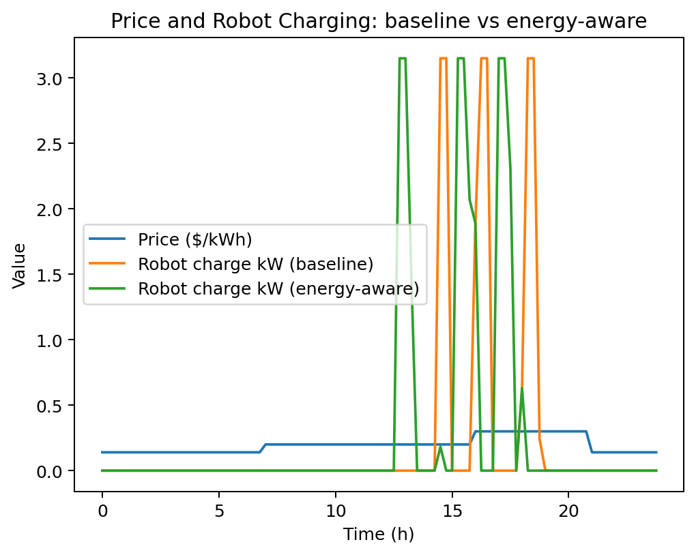
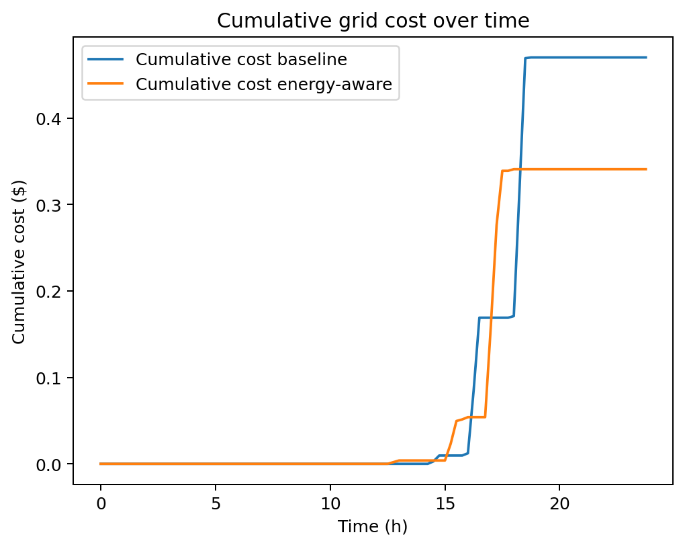
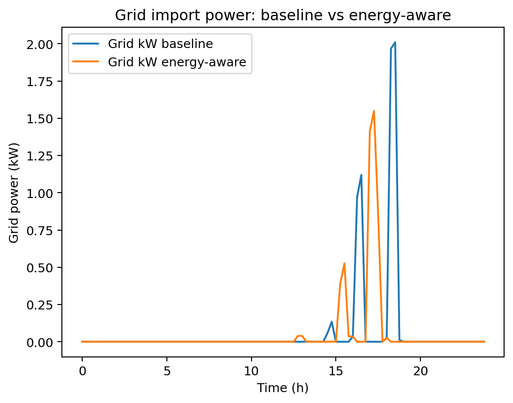
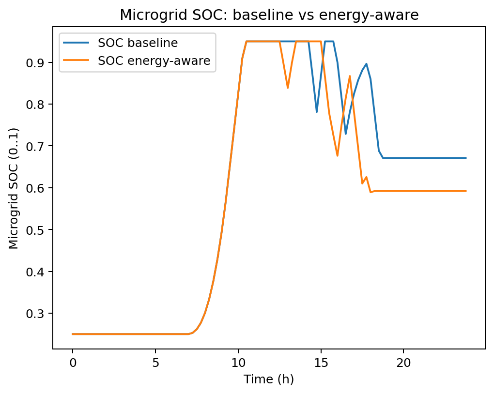

````markdown
# Energy-Aware Robot + Microgrid Planner

A Python simulation project that combines:
- **Microgrid operation** (PV + battery + grid dispatch)
- **Robot mission energy** (tasks consume energy, charging creates load)
- **Planning** (baseline vs energy-aware charging strategy)

The simulator compares how different charging/planning policies affect:
- **Grid energy import (kWh)**
- **Electricity cost ($)**
- **Battery state of charge (SOC)**

---

## Features
- Time-series simulation over a 24-hour horizon
- PV generation and time-of-use electricity pricing profiles
- Robot task list with distances, release times, deadlines, and durations
- Two planners:
  - **Baseline:** simple rule-based charging
  - **Energy-aware:** charges based on **price + PV availability**
- Outputs: CSV time series, JSON summary, plots, and a Markdown report
- Tests + linting

---

## Quickstart

```bash
python -m venv .venv
# Windows: .venv\\Scripts\\activate
# macOS/Linux: source .venv/bin/activate

pip install -e ".[dev]"

earp simulate --scenario demo
earp report --run outputs/latest

pytest -q
ruff check src tests
````

---

## Scenarios

### `demo`

A small scenario to verify the pipeline runs end-to-end.

### `peak_mission`

A stress-test scenario designed to make charging decisions matter (tasks occur near peak-price hours).

Run it reproducibly:

```bash
earp simulate --scenario peak_mission --seed 7
earp report --run outputs/latest
```

---

## Outputs

Each run is written to:

`outputs/<timestamp>/`

Typical artifacts:

* `timeseries_baseline.csv`
* `timeseries_energy_aware.csv`
* `summary.json`
* `REPORT.md`
* `fig_soc.png`
* `fig_grid_kw.png`
* `fig_price_robot_kw.png`
* `fig_cumulative_cost.png`

> `outputs/` is gitignored by design.

---

## Example results (peak_mission, seed=7)

* **Cost saved:** **$0.13**
* **Grid energy saved:** **0.36 kWh**

### Price vs Robot Charging



### Cumulative Grid Cost



### Grid Import Power



### Microgrid SOC



> Figures are copied from a run folder into `docs/figures/` so they can be committed and shown on GitHub.

---

## How it works (high level)

1. **Generate profiles**: PV power and electricity price across the time horizon.
2. **Plan robot actions**: produce a timeline of `idle`, `charge`, and `task` steps.
3. **Convert plan → load**: transform the plan into a robot charging load time series (kW).
4. **Dispatch microgrid**: PV supplies load first, then battery, then grid.
5. **Save + report**: write CSV/JSON outputs and plots.

---

## Repo structure

* `src/earp/` simulator, planners, CLI, reporting
* `tests/` unit tests
* `docs/figures/` committed figures used in README
* `outputs/` run artifacts (gitignored)

---

## Roadmap (optional)

* Replace synthetic PV/price profiles with real datasets
* Add an optimization-based planner (MILP/MPC)
* Connect to ROS 2 / Gazebo for motion-derived energy use

---

## License

MIT (see `LICENSE`).

```
```
